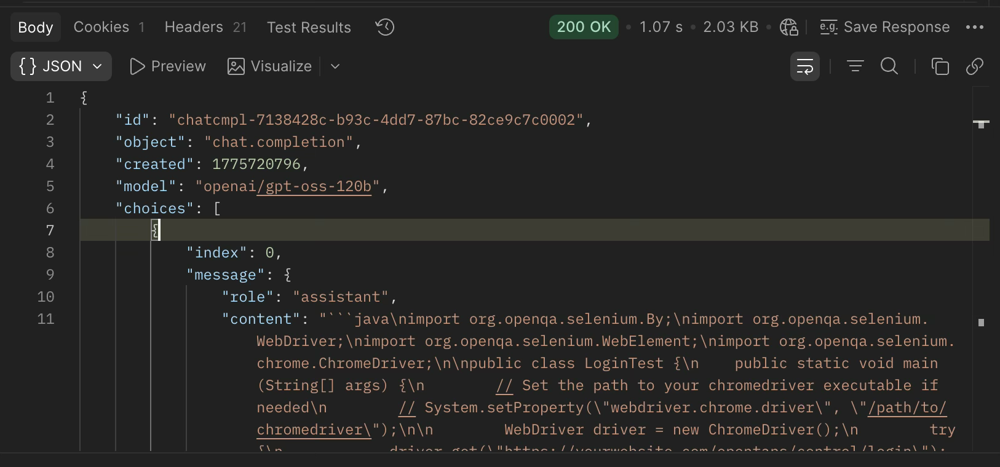
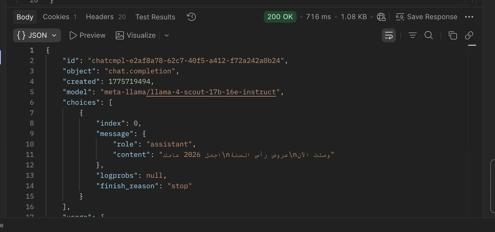
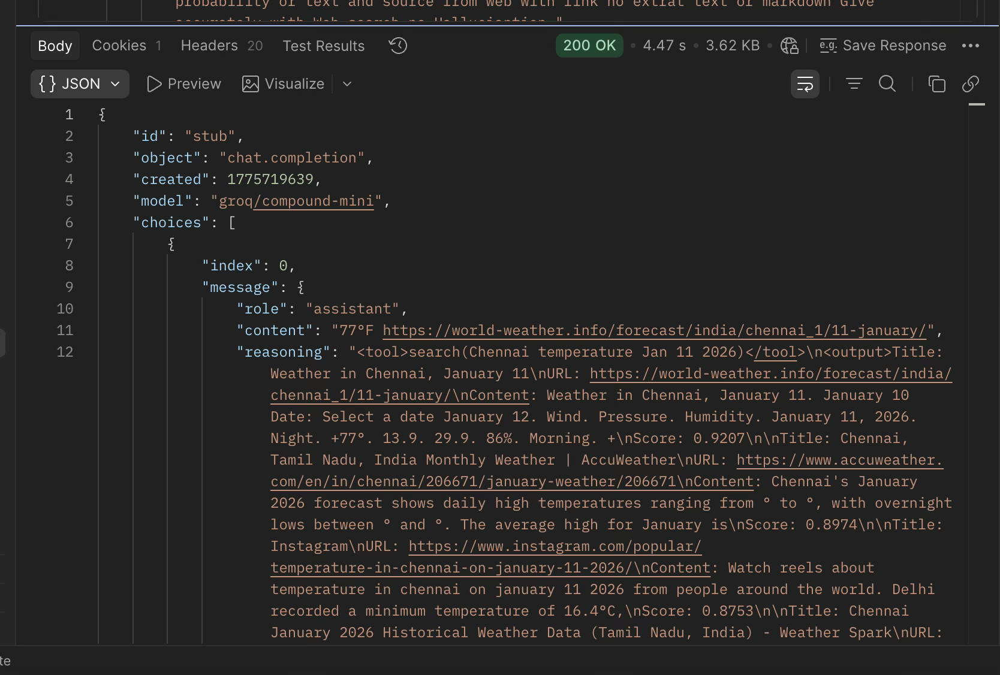
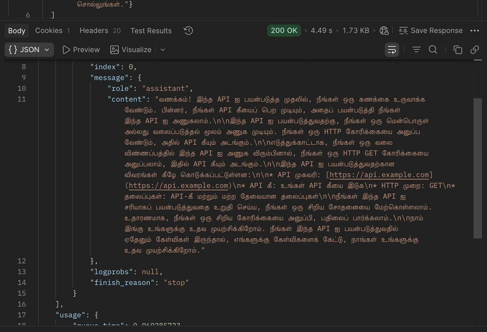

--HW 1
import org.openqa.selenium.By;
import org.openqa.selenium.WebDriver;
import org.openqa.selenium.WebElement;
import org.openqa.selenium.chrome.ChromeDriver;

public class LoginTest {
    public static void main(String[] args) {
        // Set the path to your chromedriver executable if needed
        // System.setProperty("webdriver.chrome.driver", "/path/to/chromedriver");

        WebDriver driver = new ChromeDriver();
        try {
            driver.get("https://yourwebsite.com/opentaps/control/login");

            // Username field
            WebElement usernameInput = driver.findElement(By.id("username"));
            usernameInput.clear();
            usernameInput.sendKeys("yourUsername");

            // Password field
            WebElement passwordInput = driver.findElement(By.id("password"));
            passwordInput.clear();
            passwordInput.sendKeys("yourPassword");

            // Submit button
            WebElement loginButton = driver.findElement(By.cssSelector("input.decorativeSubmit[type='submit']"));
            loginButton.click();

            // Add any additional verification or wait logic here
        } finally {
            driver.quit();
        }
    }
}

—HW 2

HW 3

HW 4

