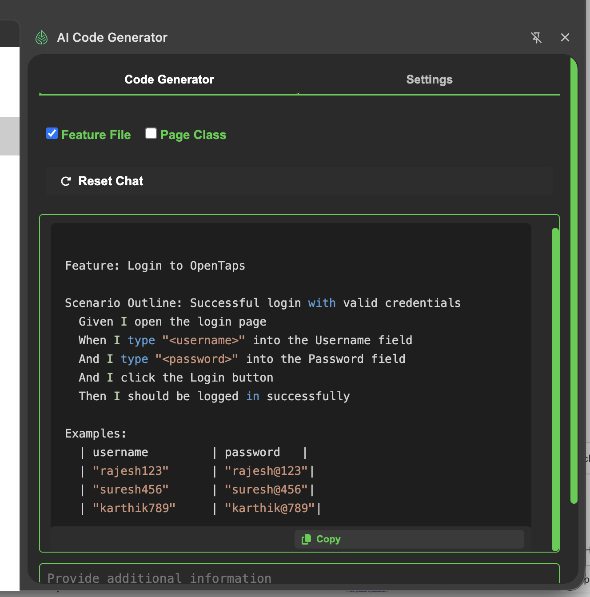
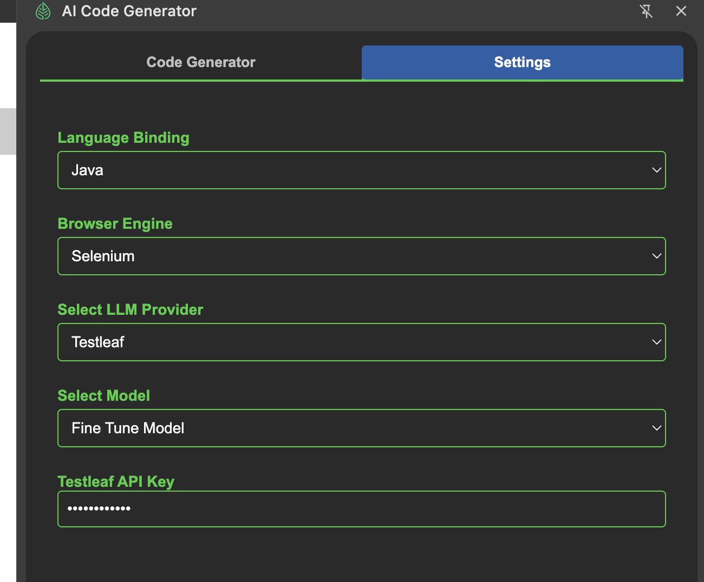

Generated fine tuned model in testleaf

ft:gpt-4o-mini-2024-07-18:testleaf-2::Dae7g6YW

added in popup.json

const modelsByProvider = {
      groq: [
        { value: 'meta-llama/llama-4-maverick-17b-128e-instruct', label: 'meta-llama/llama-4-maverick-17b-128e-instruct' },
        { value: 'openai/gpt-oss-120b', label: 'openai/gpt-oss-120b' },

      ],
      openai: [
        { value: 'gpt-4o', label: 'GPT-4o' },
        { value: 'gpt-4o-mini', label: 'GPT-4o Mini' },

      ] ,
      testleaf: [
        { value: 'testleaf/model-1ft:gpt-4o-mini-2024-07-18:testleaf-2::Dae7g6YW', label: 'Fine Tune Model' }
  
]
    };
    
    

Feature: Login to OpenTaps

  Scenario Outline: Successful login with valid credentials
    Given I open the login page
    When I type "<username>" into the Username field
    And I type "<password>" into the Password field
    And I click the Login button
    Then I should be logged in successfully

  Examples:
    | username   | password  |
    | "admin"    | "admin123"|
    | "user1"    | "user123" |
    | "user2"    | "user456" |

package com.leaftaps.stepdefs;

import io.cucumber.java.en.*;
import org.openqa.selenium.*;
import org.openqa.selenium.chrome.ChromeDriver;
import org.openqa.selenium.support.ui.*;

import java.time.Duration;

public class LoginStepDefinitions {
    private WebDriver driver;
    private WebDriverWait wait;

    @io.cucumber.java.Before
    public void setUp() {
        System.setProperty("webdriver.chrome.driver", "path/to/chromedriver"); // Set the path to your chromedriver
        driver = new ChromeDriver();
        wait = new WebDriverWait(driver, Duration.ofSeconds(10));
        driver.manage().window().maximize();
    }

    @io.cucumber.java.After
    public void tearDown() {
        if (driver != null) driver.quit();
    }

    @Given("I open the login page")
    public void openLoginPage() {
        driver.get("https://leaftaps.com/opentaps/control/main");
    }

    @When("I type {string} into the Username field")
    public void enterUsername(String username) {
        WebElement el = wait.until(ExpectedConditions.elementToBeClickable(By.id("username")));
        el.sendKeys(username);
    }

    @When("I type {string} into the Password field")
    public void enterPassword(String password) {
        WebElement el = wait.until(ExpectedConditions.elementToBeClickable(By.id("password")));
        el.sendKeys(password);
    }

    @When("I click the Login button")
    public void clickLogin() {
        driver.findElement(By.className("decorativeSubmit")).click();
    }

    @Then("I should be logged in successfully")
    public void verifyLogin() {
        WebElement success = wait.until(ExpectedConditions.visibilityOfElementLocated(By.className("success")));
        assert success.isDisplayed();
    }
}
Feature: Login to OpenTaps

  Scenario Outline: Successful login with valid credentials
    Given I open the login page
    When I type "<username>" into the Username field
    And I type "<password>" into the Password field
    And I click the Login button
    Then I should be logged in successfully

  Examples:
    | username   | password  |
    | "admin"    | "admin123"|
    | "user1"    | "user123" |
    | "user2"    | "user456" |

package com.leaftaps.stepdefs;

import io.cucumber.java.en.*;
import org.openqa.selenium.*;
import org.openqa.selenium.chrome.ChromeDriver;
import org.openqa.selenium.support.ui.*;

import java.time.Duration;

public class LoginStepDefinitions {
    private WebDriver driver;
    private WebDriverWait wait;

    @io.cucumber.java.Before
    public void setUp() {
        System.setProperty("webdriver.chrome.driver", "path/to/chromedriver"); // Set the path to your chromedriver
        driver = new ChromeDriver();
        wait = new WebDriverWait(driver, Duration.ofSeconds(10));
        driver.manage().window().maximize();
    }

    @io.cucumber.java.After
    public void tearDown() {
        if (driver != null) driver.quit();
    }

    @Given("I open the login page")
    public void openLoginPage() {
        driver.get("https://leaftaps.com/opentaps/control/main");
    }

    @When("I type {string} into the Username field")
    public void enterUsername(String username) {
        WebElement el = wait.until(ExpectedConditions.elementToBeClickable(By.id("username")));
        el.sendKeys(username);
    }

    @When("I type {string} into the Password field")
    public void enterPassword(String password) {
        WebElement el = wait.until(ExpectedConditions.elementToBeClickable(By.id("password")));
        el.sendKeys(password);
    }

    @When("I click the Login button")
    public void clickLogin() {
        driver.findElement(By.className("decorativeSubmit")).click();
    }

    @Then("I should be logged in successfully")
    public void verifyLogin() {
        WebElement success = wait.until(ExpectedConditions.visibilityOfElementLocated(By.className("success")));
        assert success.isDisplayed();
    }
}

Playwright/typescript code

import { Page, Locator } from '@playwright/test';

/**
 * Page Object for Login Page
 * Provides reusable methods for interacting with the login page elements
 */
export class LoginPage {
  readonly page: Page;
  readonly usernameInput: Locator;
  readonly passwordInput: Locator;
  readonly loginButton: Locator;

  constructor(page: Page) {
    this.page = page;
    this.usernameInput = page.locator('#username');
    this.passwordInput = page.locator('#password');
    this.loginButton = page.locator('.decorativeSubmit');
  }

  /**
   * Enters the username in the username input field
   * @param username - The username to enter
   * @returns The current LoginPage instance
   */
  async enterUsername(username: string): Promise<this> {
    await this.usernameInput.fill(username);
    return this;
  }

  /**
   * Enters the password in the password input field
   * @param password - The password to enter
   * @returns The current LoginPage instance
   */
  async enterPassword(password: string): Promise<this> {
    await this.passwordInput.fill(password);
    return this;
  }

  /**
   * Clicks the login button to submit the form
   * @returns A promise that resolves when the login button is clicked
   */
  async clickLoginButton(): Promise<void> {
    await this.loginButton.click();
  }

  /**
   * Logs in with the provided username and password
   * @param username - The username to log in with
   * @param password - The password to log in with
   * @returns A promise that resolves when the login is complete
   */
  async login(username: string, password: string): Promise<void> {
    await this.enterUsername(username);
    await this.enterPassword(password);
    await this.clickLoginButton();
  }
}